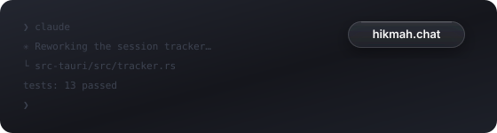

# Lanyard

A floating name tag for whichever Claude Code session you're currently looking at.

When you run a dozen Claude Code sessions across a dozen Desktops, every window
looks identical — Claude Code titles them all `✳ Claude Code`. Lanyard puts a small
always-on-top pill over the focused terminal telling you *which* session it is,
named after its repository and renameable to whatever you like.

<p align="center">
  
</p>

The pill is deliberately tiny: just the name, set in glass. It's a real
NSVisualEffectView capsule — liquid glass blurring whatever sits behind it —
dark by default, light by configuration, and exactly as wide as its text.

- **Follows you across Desktops.** One floater, pinned to every Space.
- **Follows focus within a Desktop.** Switch between two terminals on the same
  screen and the tag updates.
- **Names itself from the repo**, and remembers renames per session *and* per
  directory, so tomorrow's session in the same checkout keeps the name.
- **Throw it where you want it.** Drag needs no click-to-focus first, and
  wherever you release — or flick — the pill, it locks to the nearest corner
  and remembers.
- Everything else — Claude's own one-line summary of each session, live
  busy/idle/waiting status — lives in the Sessions panel, one tray click away.
- **Any session is a keystroke away.** ⌃⌘K summons a Spotlight-style search
  over your sessions; type a few letters, hit ↵, and its window (and Space)
  comes to the front.

---

## Install

Requires Rust and Bun.

```bash
make
```

That builds the app, installs it to /Applications, clears any stale
Accessibility grant, sets up your shell profile, and launches it. Lanyard
lives in the menu bar — there is no Dock icon. (`make build`, `make install`,
`make test`, `make doctor` and friends exist too; see the Makefile.)

On launch macOS asks for **Accessibility** access. Lanyard needs it to see
which window has focus; without it the pill stays hidden. The request is
self-repairing: macOS only shows the consent prompt while no entry exists for
the app, so a stale grant (from a rebuild) or a previously dismissed prompt
would normally swallow the request silently — Lanyard clears its own entry
first whenever it finds itself untrusted, so the prompt always appears. The
tray menu's *Accessibility access…* item re-runs it any time.

`setup-shell.sh` appends `CLAUDE_CODE_DISABLE_TERMINAL_TITLE=1` to your shell
profile — see [How it works](#how-it-works) for why that matters. Restart your
Claude Code sessions afterwards.

---

## Using it

| Action | How |
| --- | --- |
| Rename the focused session | Double-click the name on the pill |
| Reset to the repo name | Rename it to an empty string |
| Move the pill | Drag or flick it — it locks to the nearest of six positions and remembers |
| See every session | Tray › *Sessions…*, or **⌃⌘L** from anywhere |
| Find a session | **⌃⌘K** (or tray › *Find session…*) — fuzzy-search by name, repo, directory or what Claude says it's doing; **↵** jumps to it |
| Jump to a session | Click its row in the panel — its window (and Space) comes to the front |
| Hide/show the pill | Tray › *Show pill* |

When a session flips to *waiting on you*, the menu bar glyph grows a badge dot
and a notification names the session — so a blocked session on another Desktop
can't idle unnoticed. Light appearance, notifications, title management and
start-at-login all toggle from the tray menu.

The pill only appears when a Claude Code session has focus. Switch to your
browser and it gets out of the way. The panel behaves like a popover: click
anywhere else and it dismisses itself — **⌃⌘L** or the tray brings it back on
whatever Space you're on.

Settings live in `~/.config/lanyard/config.json` (the tray covers the common
ones). `"appearance"`: `"dark"` (default) or `"light"`. `"hotkey"`: the panel
shortcut, `"ctrl+cmd+l"` by default, `""` to disable. `"searchHotkey"`: the
search shortcut, `"ctrl+cmd+k"` by default, `""` to disable.

The search palette ranks like you'd hope: with nothing typed, sessions that
are waiting on you list first; a query fuzzy-matches the session name (matches
highlighted), falling back to the repo path, Claude's own summary of the work,
and the working directory — so `ju de` finds `justin06lee.dev`, and typing
what a session is *doing* finds it too.

---

## How it works

Claude Code already keeps a registry at `~/.claude/sessions/<pid>.json` with each
session's id, working directory, a derived name and a live busy/idle status. Lanyard
reads it rather than inventing its own tracking, and supplies the two things it
lacks: a link from session to *window*, and somewhere to display it.

**Identity travels in the terminal title.** This is the only channel that works
for terminals like Alacritty, where every window belongs to one shared process —
so process ancestry can't tell windows apart. Lanyard writes an OSC-0 title to each
session's tty carrying a machine-readable token:

```
hikmah.chat ⟦lanyard:6202⟧
```

**Focus resolution uses the macOS Accessibility API** to read the focused
window's title and geometry. AX deliberately reports only windows on the *active*
Space, which is exactly right here: whatever it can see is what you're looking
at. The floater is marked `visibleOnAllWorkspaces`, so a single window follows
you across every Desktop instead of one per Space.

Lanyard asks each *terminal app hosting a session* whether it is `AXFrontmost`,
rather than asking the system for its focused application. The system-wide
`AXFocusedApplication` query returns `kAXErrorCannotComplete` (-25204) on macOS
26 even with Accessibility fully granted, while per-application queries work
reliably. Scoping the question to terminals is also the behaviour we want: when
you're in a browser, no candidate matches and the floater hides itself.

### Why `CLAUDE_CODE_DISABLE_TERMINAL_TITLE`

Claude Code rewrites the terminal title as it works — `✳ Claude Code` at rest,
then a summary of the current task. Since Lanyard uses the title as its identity
channel, the two overwrite each other every few seconds. Lanyard copes (it notices
an untagged title and re-stamps, throttled to once per 750 ms) but the title
visibly flickers in Mission Control.

Setting `CLAUDE_CODE_DISABLE_TERMINAL_TITLE=1` stops Claude Code touching the
title, leaving Lanyard in sole possession. The Sessions panel tells you how many
running sessions still need this.

This is invisible in normal use: Alacritty's `decorations = "Buttonless"` hides
window titles entirely, so the title bar is free real estate. Where it *does*
show — Mission Control — the human-readable name comes first, which makes
picking the right Desktop easier.

---

## Terminal support

Developed and verified against **Alacritty**. The mechanism is
emulator-agnostic — it needs only OSC title support and AX-visible windows — so
Terminal.app, WezTerm, kitty and Ghostty should work, but those have not been
exercised end-to-end yet; reports welcome.

One caveat for **tabbed** terminals (iTerm2, Terminal.app, WezTerm): macOS
exposes a tabbed window as a single AX window, so Lanyard resolves the tab that owns
the title, which is the foreground one. Split panes within a single tab can't be
distinguished. Alacritty's one-window-per-session model has no such ambiguity.

Window ids are read from whichever of `ALACRITTY_WINDOW_ID`, `KITTY_WINDOW_ID`,
`WEZTERM_PANE`, `ITERM_SESSION_ID` or `WINDOWID` the emulator exports.

---

## Releases

CI (`.github/workflows/ci.yml`) runs the test suite on every push. Pushing a
`v*` tag runs `.github/workflows/release.yml`, which builds the DMG and
attaches it to a draft GitHub release.

Installed copies keep themselves current. Lanyard checks the latest published
release shortly after launch; when a newer version exists, the tray's *Check
for Updates…* item retitles to *Update to vX.Y.Z…* and one click downloads,
verifies (updater artifacts are minisign-signed in CI with the
`TAURI_SIGNING_PRIVATE_KEY` secret) and swaps the app in place, then
relaunches. Publishing a release is all it takes to roll everyone forward.

Release builds are unsigned unless you add signing secrets to the repository —
the workflow header lists the six needed (`APPLE_CERTIFICATE`, `APPLE_ID`,
`APPLE_TEAM_ID`, …). A signed, notarized build is worth the ceremony: macOS
keys Accessibility grants to a binary's code signature, so signed updates keep
the grant while unsigned rebuilds lose it every time.

`packaging/homebrew/lanyard.rb` is a ready cask template — copy it into a
`homebrew-tap` repository and fill in the DMG's sha256 to make the app
`brew install --cask lanyard`-able.

---

## Development

```bash
bun run dev                          # hot-reloading dev build
cargo test --manifest-path src-tauri/Cargo.toml

# Print exactly what Lanyard sees — sessions, terminal apps, focus resolution.
cargo run --manifest-path src-tauri/Cargo.toml --bin lanyard-doctor
```

| Path | Purpose |
| --- | --- |
| `src-tauri/src/sessions.rs` | Reads Claude Code's registry, enriches with tty + window id |
| `src-tauri/src/ax.rs` | Accessibility bridge: focused app, window title, rect |
| `src-tauri/src/title.rs` | OSC title stamping and token parsing |
| `src-tauri/src/tracker.rs` | Polling loop: focus → session → floater placement |
| `src-tauri/src/store.rs` | Persisted names and floater anchor |
| `ui/` | Floater and sessions panel (plain HTML/CSS/JS, no build step) |
| `assets/` | Icon artwork (SVG source of truth) |

### Icons

`assets/icon.svg` is the app icon — a badge on a cord, the pill the app draws
on screen hanging from its lanyard. `assets/icon-small.svg` is the same figure
redrawn for 16pt and 32pt: the clip ring and badge line turn to mud below
48px, so those sizes reduce to cord and pill the way Apple's small sizes do.
`assets/tray.svg` is the menu bar glyph: black on transparent, marked as a
macOS *template* image so the system tints it to match a light or dark menu
bar. `assets/tray-alert.svg` is the same glyph with a badge dot, shown while a
session is blocked waiting on you. They're rendered at 36px because tray-icon
displays them at 18pt, making that exactly 2x on Retina.

Edit the SVGs, then regenerate everything (needs `brew install librsvg`):

```bash
./scripts/build-icons.sh
```

Don't run `bunx tauri icon` on its own — it downsamples one master into every
size, which throws away the small-size artwork.

The dev build is a different binary from the bundled app, so macOS treats it as
a separate Accessibility entry — you'll be asked to grant access twice.

The app is unsigned, and macOS keys Accessibility grants to a binary's code
hash, so **every rebuild strands the previous grant**. `make install` clears
the stale entry for you, and the app itself re-prompts at launch whenever it
finds itself untrusted — so the worst case after a rebuild is granting the
fresh prompt again, never spelunking through System Settings.

---

## Troubleshooting

Run `lanyard-doctor` first — it answers most of these directly.

**The pill never appears.** Check Accessibility access is granted to the
binary you're actually running. Tray › *Sessions…* shows a banner when it
isn't, and tray › *Accessibility access…* clears any stale grant and re-asks.
`lanyard-doctor` prints `accessibility : granted` when it's in order.

**It shows the wrong session, or lags a moment behind.** Almost always the title
tug-of-war — run `./scripts/setup-shell.sh` and restart those sessions.

**A session is missing from the panel.** Lanyard lists interactive sessions with a
live pid and a controlling tty; background agents (`--bg`) are excluded by
design.

`lanyard-doctor` ships inside the bundle too, so an installed copy can be checked
without the source tree:

```bash
/Applications/Lanyard.app/Contents/MacOS/lanyard-doctor
/Applications/Lanyard.app/Contents/MacOS/lanyard-doctor 1239   # probe a specific app pid
```

## License

MIT — see [LICENSE](LICENSE).
