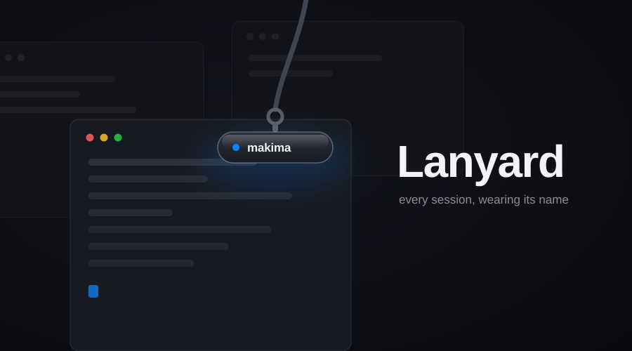

<div align="center">



# Lanyard

**A floating name tag for whichever Claude Code session you're looking at.**<br>
*Liquid glass over the focused terminal, a Spotlight for sessions, and a nudge when one is waiting on you.*

</div>

---

Run a dozen Claude Code sessions across a dozen Desktops and every window looks
identical — they're all titled `✳ Claude Code`. Lanyard pins a tiny always-on-top
glass pill over the focused terminal that says *which* session it is: named
after its repository, renameable to anything, joined by a dot that breathes
while Claude works and turns orange when it's waiting on you.

- **One pill, every Desktop.** It follows you across Spaces and across focus
  changes within one — and hides the moment a non-terminal has focus.
- **Any session is a keystroke away.** ⌃⌘K opens a Spotlight-style search over
  your sessions; ↵ carries you to the window (and its Space).
- **Blocked sessions can't idle unnoticed.** The menu bar glyph grows a badge,
  a notification names the session, and ⌃⌘J jumps straight to it.
- **Names stick.** Renames are remembered per session *and* per directory, so
  tomorrow's session in the same checkout keeps today's name.
- **Throw the pill where you want it.** Drag or flick — it locks to the
  nearest of six positions and remembers.

## Install

```bash
brew tap justin06lee/tap
brew install --cask lanyard
```

Or from source (requires Rust and Bun):

```bash
make
```

That builds, installs to /Applications, clears any stale Accessibility grant,
sets up your shell profile, and launches.

Lanyard needs three grants from macOS: **Accessibility** (to see which window
has focus — the pill stays hidden without it), **Notifications** (the
waiting-on-you banners), and **file access** for session folders on external
volumes. macOS queues its consent dialogs one behind another and a missed one
is indistinguishable from a bug, so Lanyard opens a **Permissions checklist**
at launch whenever something is ungranted — live dots that turn green the
moment macOS applies a grant, and a button per row that actually re-asks.
It's in the tray as *Permissions…* any time.

`setup-shell.sh` (run by `make`) exports `CLAUDE_CODE_DISABLE_TERMINAL_TITLE=1`
in your shell profile — see [How it works](#how-it-works) for why. Restart
your Claude Code sessions afterwards.

## Using it

| Action | How |
| --- | --- |
| Rename the focused session | Double-click the name on the pill |
| Reset to the repo name | Rename it to an empty string |
| Move the pill | Drag or flick it — it locks to the nearest of six positions and remembers |
| See every session | Tray › *Sessions…*, or **⌃⌘L** |
| Find a session | **⌃⌘K** — fuzzy-search, **↵** jumps to it |
| Jump to a *waiting* session | **⌃⌘J** — press again to cycle through them; nothing waiting opens the panel instead |
| Check permissions | Tray › *Permissions…* |
| Update | Tray › *Check for updates…* (it also checks quietly at launch) |

The **panel** lists every session with a live status dot, Claude's own
one-line summary of what it's doing, and click-to-jump. It behaves like a
popover: click anywhere else and it's gone; the tray or ⌃⌘L brings it back on
whatever Space you're on.

The **search** ranks like you'd hope: with nothing typed, sessions waiting on
you list first; a query fuzzy-matches the name (matches highlighted), falling
back to repo path, Claude's summary, and the working directory — so `ju de`
finds `justin06lee.dev`, and typing what a session is *doing* finds it too.

Settings live in `~/.config/lanyard/config.json`, but the tray covers all the
common ones — appearance, notifications, title management, start-at-login,
and every shortcut via preset pickers (⌃⌘, ⌥⌘, ⇧⌘ variants, or disabled).
The config file accepts any combo the presets don't offer.

## How it works

Claude Code keeps a registry at `~/.claude/sessions/<pid>.json` with each
session's id, cwd, name and live busy/idle/waiting status. Lanyard reads that
rather than inventing its own tracking, and supplies the two things it lacks:
a link from session to *window*, and somewhere to display it.

**Identity travels in the terminal title.** It's the only channel that works
for terminals like Alacritty, where every window belongs to one shared
process. Lanyard writes an OSC-0 title to each session's tty carrying a
machine-readable token:

```
hikmah.chat ⟦lanyard:6202⟧
```

**Focus arrives as events.** Lanyard keeps an `AXObserver` on each terminal
app hosting a session — activation, focus, geometry and title changes wake it
instantly, so switching or dragging windows moves the pill the moment it
happens. A once-a-second fallback re-reads the registry and covers anything an
observer missed. Resolution asks each terminal whether it is `AXFrontmost`
rather than using the system-wide focus query (which returns
`kAXErrorCannotComplete` on macOS 26); scoping to terminals is also exactly
the semantics the pill wants — in a browser, nothing matches and it hides.

**Notifications post through UNUserNotificationCenter** directly: macOS 26
silently discards the deprecated notification API most tooling still uses.

### Why `CLAUDE_CODE_DISABLE_TERMINAL_TITLE`

Claude Code rewrites the terminal title as it works, and Lanyard uses the title
as its identity channel — without the variable the two overwrite each other
every few seconds. Lanyard copes (it notices untagged titles and re-stamps,
throttled) but the title visibly flickers in Mission Control. Setting
`CLAUDE_CODE_DISABLE_TERMINAL_TITLE=1` leaves Lanyard in sole possession; the
panel counts the sessions that still need it.

## Terminal support

Developed and verified end-to-end against **Alacritty**. The mechanism needs
only OSC title support and AX-visible windows, so Terminal.app, WezTerm,
kitty and Ghostty should work — reports welcome. Tabbed terminals resolve to
the foreground tab (macOS exposes a tabbed window as one AX window); split
panes within a tab can't be distinguished. Window ids are read from whichever
of `ALACRITTY_WINDOW_ID`, `KITTY_WINDOW_ID`, `WEZTERM_PANE`,
`ITERM_SESSION_ID` or `WINDOWID` the emulator exports.

## Development

```bash
bun run dev                                        # hot-reloading dev build
cargo test --manifest-path src-tauri/Cargo.toml    # the test suite
make doctor                                        # print exactly what Lanyard sees
```

| Path | Purpose |
| --- | --- |
| `src-tauri/src/sessions.rs` | Reads Claude Code's registry, enriches with tty + window id |
| `src-tauri/src/ax.rs` | Accessibility bridge: focus, geometry, raise, observers |
| `src-tauri/src/title.rs` | OSC title stamping and token parsing |
| `src-tauri/src/tracker.rs` | The event-driven loop: focus → session → pill placement |
| `src-tauri/src/notify.rs` | UNUserNotificationCenter bridge |
| `src-tauri/src/store.rs` | Persisted names, anchor, shortcuts |
| `ui/` | Pill, panel, search and permissions windows (plain HTML/CSS/JS) |
| `assets/` | Icon artwork (SVG source of truth) |

When something looks wrong, run `lanyard-doctor` first — it prints the
sessions, terminal apps and focus resolution exactly as Lanyard sees them,
and ships inside the bundle
(`/Applications/Lanyard.app/Contents/MacOS/lanyard-doctor`). A missing pill
is almost always the Accessibility grant (tray › *Permissions…* shows and
fixes it); a wrong or lagging name is almost always the title tug-of-war
(`./scripts/setup-shell.sh`, then restart those sessions). Background agents
(`--bg`) are excluded from the panel by design.

Icons: `assets/icon.svg` is the app icon, `icon-small.svg` the 16/32pt
redraw, `tray.svg`/`tray-alert.svg` the template menu bar glyphs. Edit the
SVGs and regenerate with `./scripts/build-icons.sh` (needs
`brew install librsvg`) — don't run `bunx tauri icon` alone; it downsamples
one master and throws away the small-size artwork.

The app is unsigned, and macOS keys TCC grants to a binary's code hash, so
**every rebuild strands the previous grants**. `make` clears the stale
entries, the app re-prompts itself whenever it finds itself untrusted, and
the Permissions window shows live exactly what's missing — the worst case is
clicking a fresh prompt, never spelunking through System Settings.

## Releases

CI runs the tests on every push; pushing a `v*` tag builds the DMG and drafts
a GitHub release. Installed copies keep themselves current: a quiet check at
launch retitles the tray item when a newer release exists, and one click
downloads, verifies (updater artifacts are minisign-signed in CI) and swaps
the app in place. The live cask is in
[justin06lee/homebrew-tap](https://github.com/justin06lee/homebrew-tap);
bump its `version` and `sha256` when a release ships.

Release builds are unsigned unless the `APPLE_*` secrets exist in the
repository — the workflow header lists the six and signing turns on by
itself once they do. Signed builds are worth the ceremony: macOS keys TCC
grants to the code signature, so signed updates keep every grant unsigned
rebuilds lose.

## License

MIT — see [LICENSE](LICENSE).
